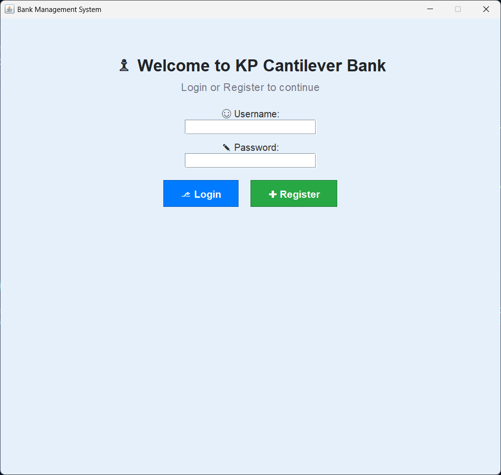
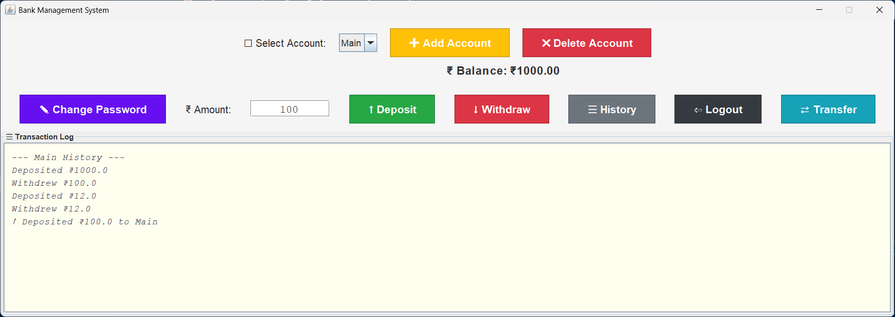
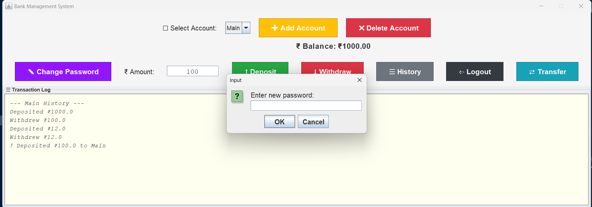
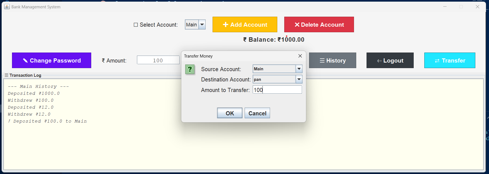

# 1. 🏦 KP Cantilever Bank Management System

A Java Swing-based banking application providing a full-featured graphical user interface for user registration, login, managing multiple accounts, performing deposits, withdrawals, transfers, and viewing transaction history with persistent data storage.

---
# 2. 🎯 Features
- 🔐 User Management
- 🏦 Account Management (per user)
- 💰 Transaction function(Deposit and withdraw)
- 📊 Live Balance Display (updates instantly)
- 📜 Transaction History Log
- 🎨 Clean and Colorful UI using Swing
- 💾 Data Persistence

---

## 3. 🖼️ Screenshots

>  
>  
> 
> 
> 

---

## 4. 🧰 Technologies Used
 ___________________________________________
| Technology    | Purpose                   |
| ------------- | ------------------------- |
| Java (JDK 8+) | Core programming language |
| Swing         | Graphical user interface  |
| OOP Concepts  | User and Account handling |
| File I/O      | Domain models:User,Account|
 -------------------------------------------
---

## 5. 🚀 Getting Started

### ✅ Prerequisites

- Java Development Kit (JDK) version 8 or higher
- Java IDE or command line tools for compiling and running Java GUI applications

### 🔧 Setup Instructions

**compile and run**

   ````bash
   
   javac *.java
   java BankInterface

   ````
# 6.🗂️ Project Structure and Classes Overview
  >BankInterface.java — Main Swing GUI class implementing login, dashboard, and all user interactions

  >BankServer.java — Backend management handling user registration, login, data persistence to file

  >Accountholder.java — Represents a user including username, password, accounts list, last login time

  >AccountManage.java — Represents individual bank accounts with balance and transaction records

# 7.🛠 Usage Notes
- Users must register before logging in.
- Each user starts with a default "Main" account. Additional accounts can be created or removed (except "Main").
- Deposits, withdrawals, and transfers validate input and funds availability, with transaction logs updated accordingly.
- Password changes are saved persistently and require the user to enter a new password at runtime.
- All data is saved locally to Accdetails.txt for persistence across sessions.
